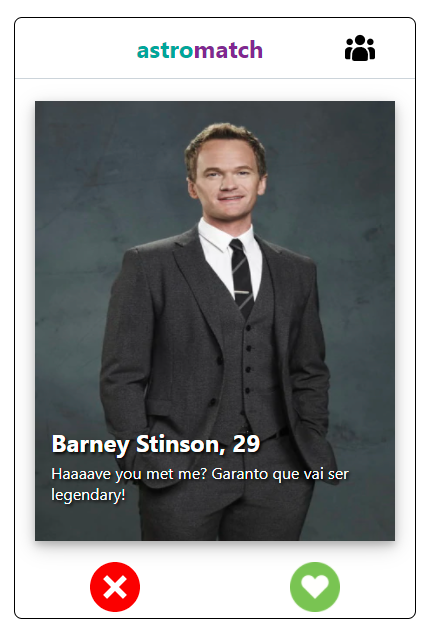

# Astromatch :heart:

The aim of the Astromatch project was to create an application similar to Tinder. It was built with React, JavaScript, and styled components.

This was a 2 week project built during the module of Advanced React and Hooks at the Labenu FrontEnd Curse. Project goals included using technologies learned up until this point and familiarizing myself with API calls and useState and useEffect Hooks.  

The application has two screens. Upon entering our application, the user is able to see a profile option to choose from. The photo, name and description of the profiles is shown. Two buttons are on the screen: one that allows you to "match" (a "positive" choice) and the other that allows you to discard the suggestion (a "negative" choice). Finally, there is a button at the top that takes you to the matches screen.  

The second screen is made up of a list of users who "corresponded" with the user who is using one of our application. They were defined as photos and profile names. Finally, the user can clear the information of the matches they gave at any time on the second screen of the website pressing the clear button at the botton of the second screen.

[Surge Link](https://useful-soda.surge.sh/)

## Project Screen Shots

#### Screen 1

#### Screen 2


## Languages & tools

- Javascript
- React
- Node
- Axios

## Installation and Setup Instructions


Clone down this repository. You will need `node` and `npm` installed globally on your machine.  

Installation:

```bash
$ git clone https://github.com/ZanalikSL/projetos.git
$ cd astromatch
```
## Use

```bash
# Instalar as dependências
$ yarn

# Iniciar o projeto
$ yarn start
```

To Run Test Suite:  

`npm test`  

## Improvements to the project

- The clear option sometimes dont work. Fix that


